# リモートワーク（テレワーク）

リモートワークとは、会社以外の場所（自宅）からリモート（遠隔）で仕事をすることです。テレワーク[^telework]のほうが一般的な呼び名になっていますが、ぶっちゃけダサいので、本書ではリモートワークと呼ぶことにします。

[^telework]: 1970年代に生まれた言葉ですが、現代で未だに使っているのは日本くらいで、総務省ワードです。詳しい歴史は https://en.wikipedia.org/wiki/Telecommuting を読むと分かるかもしれません。

職場に集まって働く旧来のスタイルを、ひとまずこの章ではオフラインワークと呼びます。

仕事をする場合、オフラインワークでも、リモートワークでも、やること自体はそんなに変わりませんが、リモートワークにはいくつかの成立条件やコツがあります。この章ではそれらノウハウを余すことなく記します。以下、オンラインという単語もだいたいリモートと同じように捉えてもらって構いません。

## コミュニケーション

リモートワークのためのコミュニケーションにはいくつかコツがあります。

### 意図的に雑談をしよう

オフラインワークでもそれなりに雑談をする時間はあったことでしょう。休憩時間もあるはずですし、喫煙所もあれば、飲み会もあります。仕事中、雑談に興が乗ることもあります。雑談から思わぬ解決法が見つかることもあります。

リモートコミュニケーションでは、オフライン以上に雑談が重要です。

人と喋らず、もくもく仕事を自宅でこなしていると、気が滅入る人もいれば、本来必要だったコミュニケーション・情報共有が欠けることも珍しくありません。

想像してみてください。オフラインワークでシーンと静まり返っています。誰も声を出すことができず、物音を出すのもはばかる状況。8時間20営業日12ヶ月それが続くのって、しんどくないですか？

そういった状況では、本来必要だった情報共有も行われないでしょう。

そこで、必要なコミュニケーション・情報共有をするためにも、雑談をすることで敷居を下げましょう。

ここでいう雑談は、Slack などテキストコミュニケーションでの会話です。

Slack であればおそらく `#random` という雑談用チャンネルがあるはずです。もし社員数が多すぎて `#random` で雑談をする勇気が持てない場合、もう少し小さい単位で雑談できるチャンネルがあってもいいでしょう。たとえば `#tech_random` というエンジニアのための雑談チャンネルであったり `#team10_random` というようなチームごとの雑談チャンネルです。

できるなら、大きい単位で気軽に雑談ができる雰囲気を作ったほうが有利です。そうじゃないと、仲良しグループみたいなものができてしまって、チームを超えた情報共有がしづらくなります。でも、それによって喋りづらい雰囲気ができてしまったり、文化の違うチーム同士で諍いが起きては元も子もありません。適切なサイズ感を見極める必要があります。

### 気軽に質問しよう

気軽に質問をしましょう。気軽な質問を過剰なまでに歓迎するくらいの空気を作りましょう。

リモートワークでの強敵は「ハマり」です。もちろんオフラインワークでもハマってしまうことはありますが、リモートだとオフライン以上にハマり状態は見えづらいものです。

それに、リモートでの質問自体は、オフラインよりも低コストですし、何より同じ状況にいる人にとって役立つものです。

同じタイミングで悩んでいる人がいれば、一人への回答で複数人の人が助かることになります。

同じタイミングではないとしても、オフラインコミュニケーションでは質問は揮発性のものですが、リモートコミュニケーションでは質問は流れてしまう[^question-flowed]かもしれませんが残るはずです。

[^question-flowed]: Slackの場合、課金しなければ、発言は最新1万件しか参照できません。課金すればそれらの参照も可能です。ただ過去の発言は探しづらいという問題もあります。

そもそも質問とは、状況、説明、仕組み、そういったものに何かしらの不足があるサインかもしれません。もちろん単に当人の不勉強が原因かもしれませんが、属人化されてしまっていた様々な情報を整理するチャンスでもあります。

気軽な質問をできる空気を作ることができれば、こういったサインを見逃さないチーム作りもできるでしょう。

### 基本はパブリック

オフラインワークの時代は、色々なことが秘密裏に決まることも珍しくありませんでした。座席で相談したこと、喫煙所での話し合い、そういったものはよくあるものです。それら過程は正確には残されず、成果物という形だけが残るのです。

リモートワークでは、過程を残すことも低コストで可能です。

仕事に関して、よほどの理由が無い限りはDMやプライベートルームは使わないことをおすすめします。

DMやプライベートルームによる密談は、情報共有とは対極にあるものです。どうしても情報の取り扱いが問題になるようなもののみを限定共有という形にして、そうじゃないものは全て共有するほうが円滑に仕事が進みます。

もちろん、これは会社の文化もありますし、頑なにそれを拒む人もいるかもしれません。リモートワークに向いた会社とそうじゃない会社は、こういったところに現れます。

### 分報

## 情報共有

どういう仕事のスタイルにせよ、情報共有は重要です。

電子化されていない職場での情報共有にはとても大きなコストがかかりますが、リモートワークのような電子化前提の環境では、古い仕組みよりはよほど情報共有のコストが下がるでしょう。

ただし、情報共有は勝手に行われるものではありません。何かしらの仕組みを作らなければ、情報共有をしようというモチベーションは発生しづらいものです。

また情報共有をしていても、それが埋もれてしまえば、実際には共有されていないのと同じになってしまいます。

適切な情報共有の仕組みがあれば、仕事の効率を下げる諸問題に対処しやすくなります。たとえばハマりどころがあったとしても、同じところでハマるということを避けられるでしょう。

逆にいうと、適切な情報共有をしていなければ、同じところでハマる、誰かが解決方法を知っているのにハマるといった無駄が生じる可能性が増します。よほど優秀な人材が揃っていればそのようなことは無いかもしれませんが、そういう奇跡の類いを期待するよりは、情報共有の仕組みを整えるほうがよいでしょう。

情報共有は全体の生産性を上げるためのものです。

* 情報共有を妨げる要因を排除する（マイナス要因を無くす）
* 情報共有を促す仕組みを作る（プラス要因を作る）
* 共有された情報を探しやすくする

この節ではこれらについて解説します。

### 情報共有を妨げる要因を排除する

情報共有を妨げる要因はいろいろあります。

たとえば、情報共有に手間がかかると、それは妨げる要因になります。気軽に情報共有をできるようにしておくべきでしょう。これは前述の、コミュニケーションが滞れば情報が出てこないという話と同様です。面倒な手続きがあるようならそれは取っ払うべきです。

文化的に情報共有を妨げることもあります。失敗を報告しづらい文化であれば、失敗に関する情報共有は期待できないでしょう。失敗は本来、とても重要な情報源です。

### 情報共有を促す仕組みを作る

情報共有をすれば自分にとってプラスになるようになれば、情報共有は促されるでしょう。

多くの会社・組織にとって情報共有そのものは目的ではないため、情報共有に直接のインセンティブを設定しづらいですが、情報共有が重要であるという合意が取れれば、評価基準に組み込みやすくなります。

たとえばいい情報を共有した人に何かしら評価が付く仕組みを用意するという方法があるでしょう。ドキュメント共有システムによっては「イイネ」を付けられるようなものもあります。

情報を共有することでチームとして作業しやすくなれば、チームとして活動する自分に跳ね返ってくるでしょう。チームのオンボーディング[^team-onboarding]がスムーズになるような情報共有をすれば、チームに人員が不足しがちな現場では、即戦力を得て、自分の負担が減るというモチベーションになるかもしれません。

[^team-onboarding]: オンボーディングとは新しいメンバーが必要な知識・情報・スキル・行動などを習得できるようにすることで、もう少しわかりやすくいうとチームに馴染んで仕事を回せるようにすることです。1970年代のアメリカで生まれた単語ですが、最近日本で流行りの人事用語です。

### 共有された情報を探しやすくする

たとえば情報を探しやすくするようにするためのドキュメント（ページなど）を作るという方法があります。チームに入った人間が最初に見るべきドキュメントを作成し、そのドキュメントから必要な他のドキュメントへのハイパーリンクを作成したり、解説をまとめたりしておいて、そのURLを適切な場所においておくようにします。

ディレクトリ型のシステムであれば、適切なディレクトリ構成をメンテナンスすれば、たどり着きやすいでしょう。

タグのあるシステムでは、適切なタグを付けるように心がける、タグ付けのガイドラインを提示する、ドキュメントを漁って適切なタグを付与する（メンテナンスする）というような方法がとれるでしょう。

#### [column] 自主的に動くことの重要性

リモートワークでは自主的に動ける人が強いです。自主的に動かないと、周りからも評価されにくいというのはあります。

特に情報共有などでは、ボトムアップで動かないと、ずっと使いづらいままになりがちです。

組織としてそういった活動を評価できるべきですが、そうなっていない場合でも、自主的に情報共有をしていくほうが、メンバー各自にとっても働きやすいはずです。

#### [/column]

## 働き方

今度はリモートワークでの働き方そのものにフォーカスをあててみましょう。在宅で仕事をする場合、気分の切り替えがとても重要になります。気をつけないと、仕事と生活の境界線が曖昧になってしまいますし、同じ状況が続くとしんどいと感じる人もいます。

### 気分の切り替え方

人によって気分の切り替え方は様々です。ここに挙げるのは一例です。

#### 服を着替える

仕事モードの服を用意してもいいでしょう。カメラで自分の姿を映さないのであれば、いっそコスプレをしてもいいかもしれません[^cos-warn]。

ここで大切なことはスイッチを切り替えることです。自分の気持ちが最高にアガるような服装を見つけるといいでしょう。

[^cos-warn]: 荷物が届いたり、出前が届いたりしたときにこまるかもしれません……。そういうときはお気をつけを。

休憩時間の切り替えをどうするかは悩ましいものです。リモートワークと定時労働は相性が悪いですが、どうしても会社との契約上、定時労働をしなければいけない場合は休憩時間も服装を変える必要はないでしょう。

ちょっとした小物でスイッチを切り替えるというのもありでしょう。たとえばネクタイをしてる人であれば、休憩時間はネクタイを緩めるとかです。社員証があれば、首からぶら下げてる時間を労働モードとするというのもありでしょう。

#### 美味しいお茶を飲む

もちろんお茶じゃなくても、コーヒーでもジュースでも青汁でもなんでも構いません。どうせなら少し高めのお茶を買ってみてもいいでしょう。

お茶請けに美味しいお菓子を用意してもいいかもしれません。頭脳労働には甘いものが有効です。

#### 香りを楽しむ

香りは意外とバカにできません。脳は香りによってモードが切り替わるものです。前述の美味しいお茶を飲むというのも、香りを楽しむひとつの手段です。

自宅であれば人に気兼ねすることなくアロマを楽しめるでしょう。家族や同居人がいれば、迷惑をかけない範囲で、ですが。

#### 体を動かす

椅子に座りっぱなしはとてもとても不健康です。在宅勤務に限りません。

最低でも、30分に一度は立ち上がりましょう。できればストレッチやヨガなどで体をほぐすといいでしょう。首や肩が凝っていませんか？

#### 音楽を流す

オフラインの職場よりは気兼ねなく音楽を聞けることでしょう。音楽は脳のモード切り替えにも大きな意味合いを持ちます。

歌詞のある歌を聞くのもいいですが、人によっては集中しづらいこともあります。その場合、筆者のオススメの1つはインスト曲、つまり人間の歌が入らない楽器だけの曲です。映画のサントラや、インスト曲専門バンドの曲などがあります。

2つめのおすすめは環境音です。雨音とかが有名かもしれませんが、カフェの音、雑踏の音というものもあります。

音楽は脳のモードを切り替えると書いた通り、同じ音楽を聞き続けるとモードが固定化されてしまいます。気分転換という意味では、モード切り替え時に、音楽の種別を変えるべきでしょう。

#### 楽しむこと

あれこれ気分転換の方法を書いてみましたが、どれにも共通することは楽しむことです。自分なりの楽しみを見つけてください。

### 働きすぎない

労働と生活のスイッチが難しいという性質上、リモートワークでは働きすぎることが度々生じます。「キリのいいところまで」で時間が伸びることもありますし「お腹があまり空いてない」で伸びることもあります。

### 気をつけよう

### 1日の休憩時間を設定する　　　
 
リモートワークにおいて自宅は職場であると共に私生活の空間でもあるため、同じ空間の中でONとOFFのメリハリをハッキリつける必要があります。

スイッチの切り替えをおざなりにしていると、仕事が間延びしたり、食事や休憩の時間や作業終了時刻が予定とズレてしまったりするからです。

スイッチの切り替え方のひとつとしてオススメしたい方法は、1日のどのタイミングでどう休憩するかを記した「休憩時間割」を作成することです。

休憩時間割は頭のリフレッシュと作業の区切り付けを目的として作成します。

一例を挙げると、「毎時0分になったらコップに水を注いで飲む」や、「15時0分になったら3分間ストレッチをする」、「16時0分になったら小皿に素煎り大豆を盛る」などです。

特に「水を飲む」行為はオススメで、ぼうっとした脳をクリアな状態に戻せる効果があります。

作成の際は、「休憩」とだけ書くのではなく、それを見れば何をすればいいのか一意に理解できるように書くことを意識しましょう。

休憩のときに「何をして休憩しよう」と悩んで無駄に脳を消耗させないようにするためです。

これを作ることで、リモートワーク特有の問題である仕事の間延びや思考力の浪費を防ぐことができます。

また、細かく小休止を取り入れることで頭の整理時間を設けることもできます。

指定時刻に確実に休憩できるよう、デスクトップ通知やアラームを起動してくれるような媒体で時間割を作成するといいかもしれませんね。

## リモートワークを支えるソフトウェア

リモートワークでもオフラインワークでも、実はさほど、使うソフトウェアに違いはありません。実際この節で挙げるツールはオフラインワークでも普通に使われているものがほとんどです。

### コミュニケーションツール

Slack, Discord, Zoom, Chatwork, Microsoft Teams などが有名どころでしょうか。

Slack を使っている企業が多いでしょう。企業のコミュニケーションツールでは全世界的に定番となっています。無料版ではなくちゃんと課金をしている場合、Slack 通話が便利です。音声通話・ビデオ・画面共有などが行なえます。

Discord は Slack よりも優れている点も多いですが、ゲーマーやオンラインコミュニティ向けのサービスなため、会社・組織では採用しづらいかもしれません。Discord は Slack に先駆けて音声通話をサービスし続けてきた歴史があります。最近では GoLive という画面共有を行える仕組みもあります。

Zoom は通話に特化したサービスで、コロナによりユーザー数が数十倍に増えたという大躍進をしています。セキュリティリスクが見つかったり顕在化もしていますが、執筆時点[^2020-05-02]では、セキュリティ改善に力を入れている最中です。

[^2020-05-02]: 2020年5月2日

Chatwork や Microsoft Teams は色々な機能が統合されたサービスです。

### ドキュメントツール

Google Document や esa, Qiita team, DocBase などが有名どころでしょうか。他にも星の数ほどある激戦ジャンルです。

これらドキュメントツールの特徴としては、同時編集をサポートしていることが多いですが、サービスによって同時編集の使い勝手が違うことは注意したほうがいいでしょう。

* 他のひとの編集によって自分のカーソルが変な位置に移動しない
* 保存ボタンを押したときに、他の人の環境でコンフリクトを起こさない
* 多人数編集で重くならない

などが分かりやすい判断基準となるでしょう。

#### [column] erukiti 的同時編集の評価

同時編集の優秀さを2020年5月2日時点の erukiti 的評価でいうと、DocBase > esa > hackmd > scrapbox です。DocBase は多人数で同時に編集しまくって困ったことが発生しません。esa はそれに少し劣る感じで、hackmd は同時に多人数でいじると結構カーソルが不思議な位置に移動します。scrapbox は多人数編集をするとストレスを強く感じました。

**※あくまで erukiti の評価です。参考までに**

### ソースコードリポジトリサービス

GitHubの一人勝ちです。よほど強い理由でもなければGitHubを使いましょう。他の選択肢は面倒なだけです。

## 機材を整える

リモートワークでは環境整備、特にここでは機材について、働きやすい環境を整えたほうが良いでしょう。生産効率や健康面に直結します。

合わない椅子、机やキーボードを使っていると、体を壊してしまう可能性があります。デスクワークにおける職業病の１つに肩こり、腰、その他関節症候群があります。

### 通話環境

オンラインで通話できるツールはいくつも登場しています。コロナ騒動でユーザー数が40倍に増えたというZoomが有名ですが、SlackやDiscordにも通話機能があります。音声通話・ビデオ通話それぞれありますが、どちらにせよ、音声がまず重要です。

さて、多人数で音声通話をするとき、意外に問題になるのが通話用の機材です。

**絶対に本体マイクと本体スピーカーを同時に利用してはいけません**

これは他人の声がエコーを起こしたりすることがあるためです。1人でもそういう人がいれば、全員の迷惑になります。必ずイヤフォンかヘッドセットなどを使いましょう。

また、品質の悪いマイクを使うと、他の人にとって聞き取りづらいという問題があるため、ある程度以上のクォリティのマイクが必須です。

通話でネックになりがちなのがビデオ通話です。回線の遅い人がいる場合はビデオ通話をオフにできるならオフにしたほうがスムーズに通話できます。

#### 椅子

**椅子はケチらない**ことを強く強く推奨します。好みがあるでしょうが、座面はメッシュタイプが良いでしょう。メッシュタイプ以外の椅子は蒸れます。あなたが安物の椅子を使って失う健康を考えれば、10万円クラスの椅子を買っても元が取れるはずです。

イス選びは、コロナのいま難しいかもしれませんが、椅子の試用ができるお店で実際に座ってみるのが一番です。

変わり種としてはバランスボールがあります。体幹の強さに左右されますが、慣れれば長時間バランスボールでも作業できるようになるでしょう。もしバランスボールを続けられないのであれば、体を動かしたほうがいいでしょう。まずは散歩からしましょう。背筋もピンと伸びます。

#### [column] バランスボールのススメ＠おやかた

4月中旬から遅ればせながら原則リモートワークになったへーしゃですが、それより先に完全リモートワークになっていた妻と椅子の取り合いが勃発しました。椅子が重要であるというのは理解するところですが、いくつもオフィスチェアがあるというのは正直邪魔ですよね。

そこで採用したのがバランスボール。めちゃめちゃ快適です。前記のように、本当に背筋がのびて肩こりが軽快しました。あと、空気椅子が非常に簡単にできるので、太ももや腰周りのトレーニングも同時にできます。大きめの奴がいいです。

なお、最初に買った奴はテーブルに対してだいぶ低かったので、作業用椅子としては難がありました。XL（75cm）のバランスボールを買ってから、QOLがだいぶ上がりました。

バランスボールは2千円くらいです。高い椅子は5万から10万、あるいはそれ以上しますし、室内でもかさばります。使わなくなったら空気を抜いておいたり、一時的には天井の角に挟んでおくことで邪魔にもなりません（時々落ちてくるのでご注意！）

ダイニングチェアで無理くりリモートワークをしていて腰がやばそうな人は、ぜひバランスボールを！超おすすめです！

#### [/column]


#### ディスプレイ

その人の視野角などに左右されますが、大きなディスプレイや、マルチディスプレイは、生産効率に直結します。

少なくともノートパソコンの小さなディスプレイでしか仕事をしたことがないような人は、一度大きなディスプレイなどを体験してみるべきでしょう。

ディスプレイ選びは、サイズと解像度とメーカーです。

Macを使ってる人は特に解像度の高いディスプレイをオススメします。Retinaにより解像度の高いディスプレイでも、文字のサイズをコントロールしやすいためです。Windowsも最近はHiDPI対応が進んできたので問題は少なくなっているでしょう。

動かすアプリケーションによっては解像度が上がると、本体性能がついていかないという事例もあるのでその点は要注意です。

サイズは、できれば27〜34インチクラスはあったほうが望ましいでしょう。

ディスプレイを追加で用意する場合に問題になりやすいのが場所です。これはディスプレイアームで解決することもあります。ディスプレイアームがあれば空中がディスプレイ置き場になるからです。机を広く使えることにもなります。このときディスプレイアームはエルゴトロンを強く推奨します。安物を買うと絶対に後悔するでしょう。

ディスプレイのメーカーはもう好みでいいと思います。昔であれば日本製にこだわるべきでしたが、現代ではもう日本より海外勢のほうが技術力が高いことも珍しくありません。選ぶときには、評判を検索したり、可能であれば店頭で実際に見たほうがいいです。

意外なサブディスプレイにはiPadがあります。今のmacOSであればiPadを簡単にサブディスプレイにできるので、MacとiPadがあれば、一度試してみてください。ペン入力も可能です。

#### [column] モニタについての悩み

現在常用していたモニタは24インチクラスのFullHD（1920×1080）でした。リモートワークを機会に大きいモニタが欲しいと思ったのですが、困ったのは余ったモニタの処遇。

買ってからしばらく経過しているため、もはや箱はありません。ヤフオクやメルカリに出すにしても、梱包が必要で、ダンボールの調達からして面倒。中古屋に持っていくこともできません。

他に転用しようにも用途がありません。ChromeCastやAmazonFireStickTVをつないでテレビとして使うというというのもない話ではないですが、すでにテレビなどの視聴デバイスは余ってます。

そうかといって、捨てるにはちと勿体無いですよね。

そして、机の上には新しいモニタがくるから置いてはおけない・・・家の中にもそんなスペースはありません。中途半端なサイズのモニタの処遇は悩ましいものです。画期的なアイディア募集！

#### [/column]


#### キーボード

人によるのでしょうが、Dellのペラいキーボードでは手を痛めるような人もいます。自宅ならキータイプ音で迷惑をかけづらいので、メカニカルスイッチを使ったキーボードも遠慮なく使えることでしょう。

* メカニカルスイッチ系
* 無接点系（東プレのRealforceなど）
* パンタグラフ・シザー式（Appleなら、Magic Keyboard）

キーボードでの選択基準は、打鍵感、キーストローク、配列などです。生産効率が劇的に変わるわけではありませんが、ストレスの度合いは大きく変わります。

#### マウス・トラックパッド・トラックボール

これはもうまったくもって好みでいいでしょう。

Appleユーザーなら多分トラックパッド一択だと思いますが。

### ネットワーク関係のTips

#### 「VPNにつないだらSlackが見れないんですけど」

VPN接続時にOpenVPNを使用している場合、Macのユーザーだけ「VPNに接続するとZoom/Slackが使えなくなる」という

OpenVPNでは、VPN接続時にVPNを通して接続する通信(社内)と
インターネットを経由して接続する通信を区別するために、 VPNサーバー側の設定でクライアントの
接続にルーティングを追加します。 [^openvpn-routing]

[^openvpn-routing]: https://openvpn.net/community-resources/setting-up-routing/

WindowsのOpenVPNクライアントはVPNサーバーのこの設定に従いルーティングの追加を行います。

Mac向けのOpenVPNクライアントTunnelblickの場合は、サーバ側のルーティングの設定とは
別にクライアントの接続の設定に「すべてのトラフィックをVPN経由で接続する」設定があるため、
デフォルトではVPNサーバー側のルーティング設定にかかわらず全ての通信がVPN経由になります。

このため、VPNサーバーに向かった通信がインターネットに抜けていかないネットワーク構成の場合は、macOSのみ
VPNに接続するとインターネットと通信するアプリケーションが動作しなくなり、エンドユーザーからは
「VPNに接続するとSlackが使えない」、という管理者からすると謎の訴えを受け取ることになります。

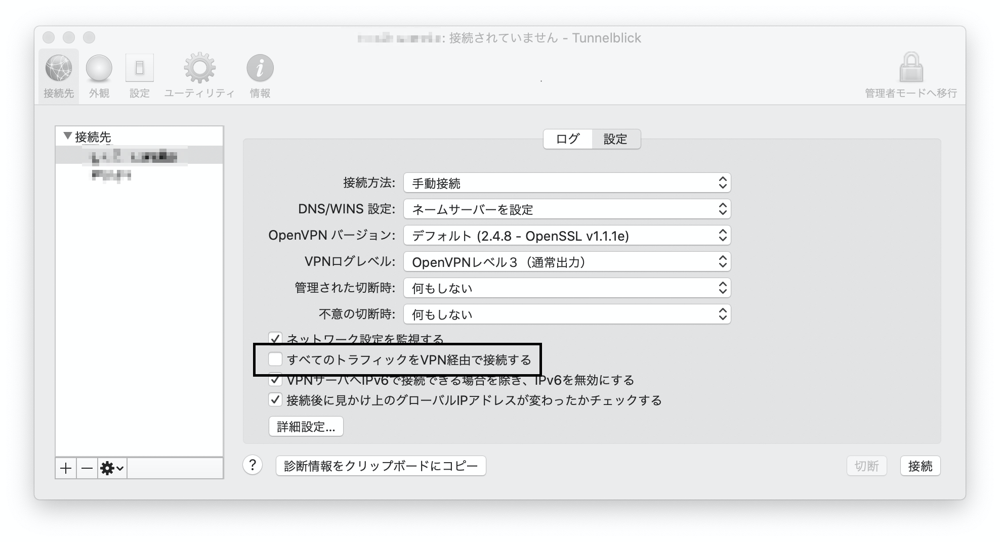

この場合は、接続設定の「すべてのトラフィックをVPN経由で接続する」の設定のチェックが外れていることを確認します。

#### 踏み台経由のssh経由接続

作業先のサーバにsshでリモートログインする際、いわゆる「踏み台」と呼ばれる途中に中継するサーバーを経由する場合は、sshのクライアントの設定ファイル [^sshconfig]にProxyCommandを記述することにより、直接リモートログイン出来ます。

[^sshconfig]: デフォルトではホームディレクトリー配下の .ssh/config 

```
Host server1
  HostName 192.168.100.8
  User pi
Host server2-proxy
  HostName 192.168.100.18
  User pi
  ProxyCommand ssh -q -W %h:%p server1
```

Windows10でも標準で提供されているOpenSSHクライアントを使うことにより踏み台経由のssh接続を行う事ができます。ただし、WindowsのOpenSSHでは、ProxyCommandに記述するコマンドが「空白を含まないフルパス」[^win2004] でなければならない、という制約があります。このため。Windowsでは、sshのクライアントの設定ファイル [^sshco
nfigwin]にssh.exeへのパスをフルパスで記述します。

[^win2004]:Windows10の次のアップデート(May 2020 Update)で解消予定です。

[^sshconfigwin]: デフォルトでは%USERPROFILE%\.ssh\config

```
Host server1
  HostName 192.168.10.8
  User pi
Host server2-proxy
  HostName 192.168.10.18
  User pi
  ProxyCommand C:\Windows\System32\OpenSSH\ssh.exe -q -W %h:%p server1
```

#### httpプロキシサーバー経由のssh接続

SquidなどプロキシサーバーにVPNなどを経由してアクセス可能な場合は、proxyサーバーへのhttp接続を経由してssh接続できます。

プロキシサーバー経由でssh接続する場合は、httpのCONNECTメソッドを使用します。httpsの通信以外でCONNECTメソッドを使用可能にするために、Squidの設定ファイル(`/etc/squid/squid.conf`)に次の設定を追加します。

```
acl SSL_ports port 22
acl Safe_ports port 22
```

接続するクライアントでは、Tera Termの場合は「設定」→「プロキシ」の項目でプロキシサーバーへの接続を設定してからリモートサーバーに接続します。

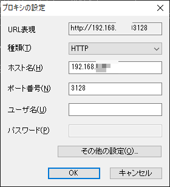

macOSの場合は、HomeBrewからsshのプロキシツールであるcorkscrewをインストールした上で、sshの設定ファイルに次のように設定を行います。

```
Host server1
  User pi
  ProxyCommand corkscrew 192.168.100.20 3128 %h %p
```

#### リモートデスクトップ接続をセキュアにする

リモートワークしている場合に、Windowsサーバーやデスクトップにリモートデスクトップでログインして作業を行う場合があります。Windowsのリモートデスクトップは、リモートデスクトップのポートにアクセスできればユーザーとパスワード認証のみでログイン可能なため、セキュリティー上脆弱な仕組みを抱えています。

ここでは、公開鍵認証を導入したOpenSSHサーバーを経由してリモートデスクトップにアクセスすることにより、リモートデスクトップにセキュアにアクセスする仕組みについて述べます。

「セキュリティが強化されたDefenderファイヤウォール」のリモートデスクトップの「スコープ」設定で、「リモートIPアドレス」の接続元に「127.0.0.1」を設定し、リモートからリモートデスクトップが接続できないようにします。

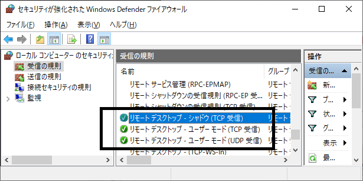

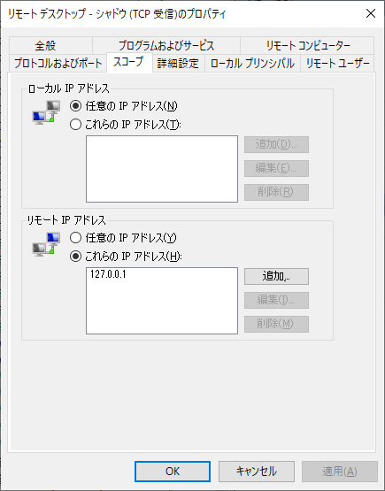

続いてOpenSSHサーバーの設定を行います。

設定の「アプリと機能」→「オプション機能」からOpenSSHサーバーをインストールします。

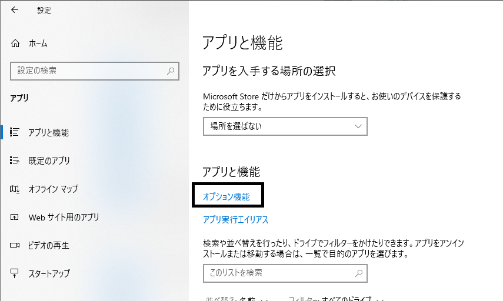

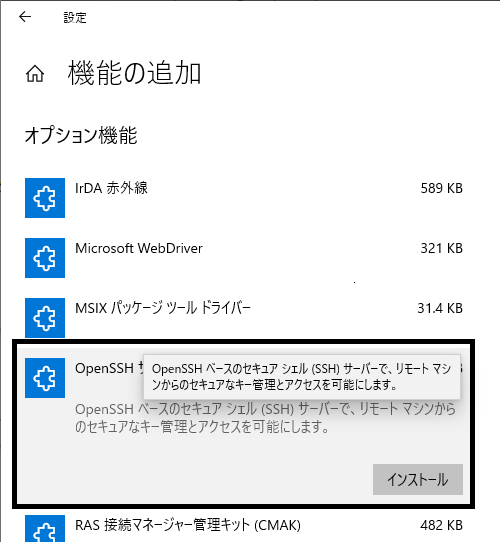

続いて公開鍵認証の設定を行います。

メモ帳を管理者権限で起動して、`C:\ProgramData\ssh\sshd_config` に公開鍵認証の設定を行います。

```
PasswordAuthentication no
```

続いて同じくメモ帳を管理者権限で起動して、作成した公開鍵を貼り付けて`C:\ProgramData\ssh\administrators_authorized_keys` に保存します。

WindowsのOpenSSHサーバーの仕様として、公開鍵ファイルへの他のユーザーからの読み取り権限を削除する必要があります。エクスプローラーで以下の操作を行います。

- `C:\ProgramData\ssh\administrators_authorized_keys` を右クリックして「セキュリティ」の「詳細設定」をクリック
- 表示されたダイアログで「続行」をクリック
- 「アクセス許可の変更」をクリック
- 「継承されたアクセス許可をこのオブジェクトの明示的なアクセス許可に変換する」をクリック
- 「Authencatied Users」へのアクセス許可を削除

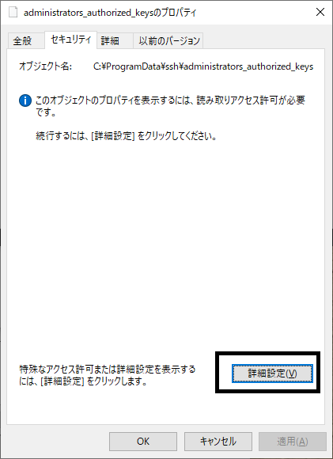

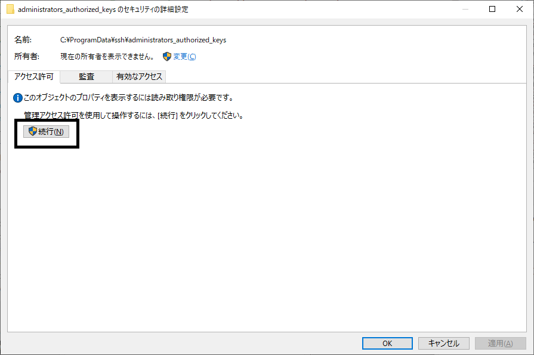

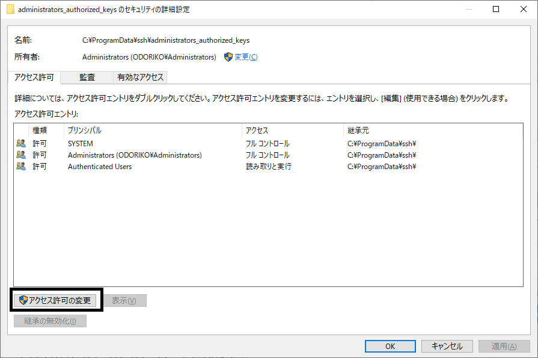

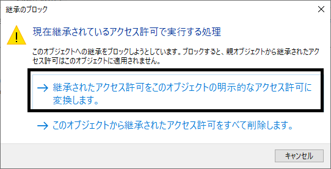

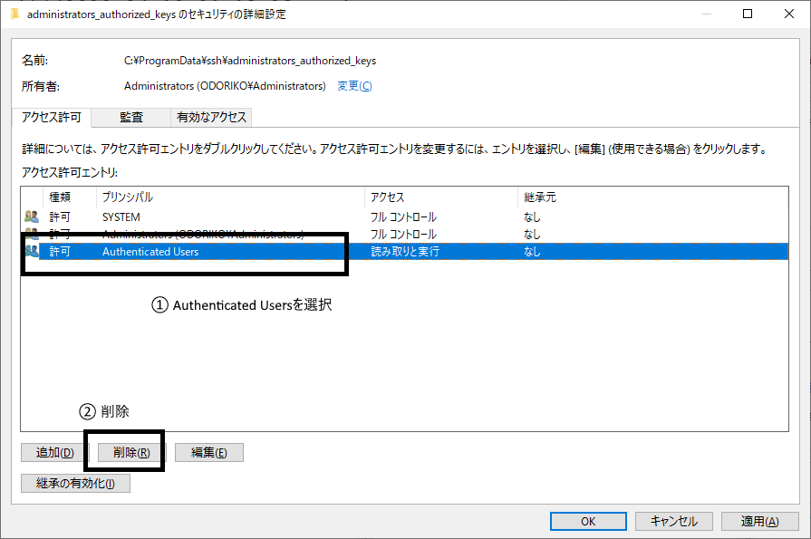

最後に、サービスで「OpenSSH SSH Server」を起動すると、公開鍵認証でのSSHのポート転送を経由した接続でのみリモートデスクトップが可能になります。


接続元のデスクトップからSSHでWindowsデスクトップに接続し、localhostのリモートデスクトップのポート(3389)にポート転送します。リモートデスクトップでポート転送の転送元のポート(この場合13389)にアクセスすると、SSHのポート転送を経由して、ファイヤウォールでアクセスを制限したリモートデスクトップにアクセスできます。

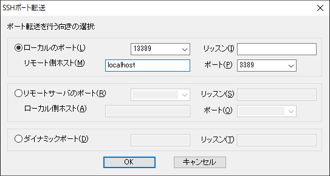

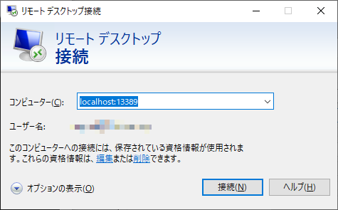


### 誰かゼロトラストネットワーク書ける人いない？

#### [column] 引きこもりの極意

コラム！

#### [/column]

#### [column] 無駄を削るということ

例えばリモートワークがメインになれば、広いオフィスを契約する必要がなくなります。リモートワークの時代においては、オフィスの解約・縮小が捗ることになるでしょう。

無駄なことをやっているとリモートワークではパンクする傾向があります。

無駄な手続きがあれば面倒で仕事がしづらいだけです。代表的なものはハンコです。よっぽど**仕事ごっこ**にしがみつきたいような会社・組織でなければ、今後はハンコ文化も最小限になることでしょう。

特に従量課金的なサービスを使っている場合は、どれだけ無駄を減らせるか？が大切になります。

#### [/column]


#### [column]　企業におけるハンコ文化について

企業において、とかく悪者にされがちなハンコ文化ですが、一応の擁護をしておきましょう。ハンコ文化滅ぶべし、という点についても、**仕事ごっこ**である側面がほとんどである点についても異論はありませんが、ごく稀に妥当性がある場合があるんじゃよ、という話です。

まず、どういう時にハンコを押すか、という観点で見ると、基本的には承認や契約の証しとしてでしょう。契約も口頭で承諾することで成立はしますが、会社として下っ端が口約束で勝手に物事を進めていくようではガバナンスとしてグダグダになります。特に知財や秘密保持契約などの重要な秘密を取り扱うような契約において、有利不利に著しく偏りがあるような契約を勝手に結ばれてはたまったものではありません。

そういう時に、然るべき人（例えば法務部門）がハンコを捺すことで、必ずそこを経由させるという形でチェック体制を確立するという意図があります。とはいえ、ガバナンスとの問題と、原紙でなくてはならない、というのは全く別問題です。原紙至上主義は滅ぶべし。

もう一つは、捺印することでその文書は有印私文書となり、偽造の場合の罰則が重くなります。有印私文書偽造は３ヶ月以上５年以下の懲役、単なる私文書偽造は1年以下の懲役または１０万円以下の罰金、となるようです。

無駄な面は多いですし、必要なのかどうなのか、という点を再確認、棚卸することは必要ですが、ハンコ＝無駄という短絡的思考に陥らず、本来の目的が何でそれを達成するためにどうあるべきかと考えることで、より良い形を模索できるでしょう。

#### [/column]
